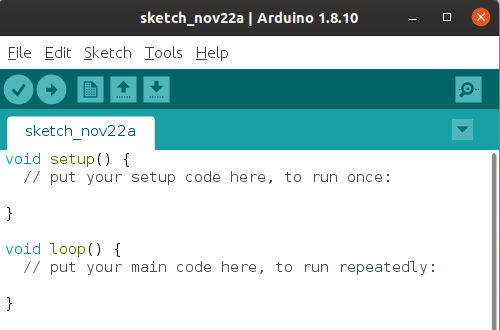

# Вступление

Долго думал с чего начать, решил начать с небольших проектов на Arduino.

Arduino - это открытая аппаратно-программный платформа, нацелена на неопытных пользователей, для старта изучения основ программирования и/или робототехники. В основе платы стоит контроллер Atmega в зависимости от плат модификация контроллера может отличаться. Более подробно можно почитать на [сайте](https://www.arduino.cc/en/Guide/Introduction).

На старте нам понадобится плата Arduino, купить можно на аликеке:

* [Arduino Uno](https://ru.aliexpress.com/item/33009726379.html?spm=a2g0o.productlist.0.0.25974fd9fmR77m&algo_pvid=a4c2fe94-1d21-4bea-8870-45489f920ec2&algo_expid=a4c2fe94-1d21-4bea-8870-45489f920ec2-4&btsid=262d814f-3b3d-4b60-88ac-79f9d32b5016&ws_ab_test=searchweb0_0,searchweb201602_2,searchweb201603_52)
* [Arduino Nano](https://ru.aliexpress.com/item/32242048437.html?spm=a2g0o.productlist.0.0.2cef6623Li5MTg&algo_pvid=c2880935-daa7-4505-8ef1-c55f42b446ff&algo_expid=c2880935-daa7-4505-8ef1-c55f42b446ff-8&btsid=aabb2643-2cef-4d2f-a6ba-15aff2c1031d&ws_ab_test=searchweb0_0,searchweb201602_2,searchweb201603_52)

Так же для фанатов всего настоящего, а не подделок с поднебесной, можно ознакомиться с продукцией на [официальном сайте](https://store.arduino.cc/usa/arduino/boards-modules)

Можно заказать ещё пару вещей:

* [Макетка](https://ru.aliexpress.com/item/32432740751.html?spm=a2g0o.productlist.0.0.d7b03000rVbFVh&algo_pvid=57930d87-1770-4d50-b1e0-da343cefe770&algo_expid=57930d87-1770-4d50-b1e0-da343cefe770-5&btsid=af2fac3e-e736-42c9-8435-5fbc0623bc91&ws_ab_test=searchweb0_0,searchweb201602_2,searchweb201603_52)
* [Проводки разного вида](https://ru.aliexpress.com/item/32662824675.html?spm=a2g0o.productlist.0.0.d7b03000rVbFVh&algo_pvid=57930d87-1770-4d50-b1e0-da343cefe770&algo_expid=57930d87-1770-4d50-b1e0-da343cefe770-2&btsid=af2fac3e-e736-42c9-8435-5fbc0623bc91&ws_ab_test=searchweb0_0,searchweb201602_2,searchweb201603_52)

Далее требуется [скачать](https://www.arduino.cc/en/Main/Software) среду разработки Arduino IDE



Для понимания базовой работы платы, можно открыть пример ```File -> Examples -> 01. Basics -> Blink```. Детальное описание этого примера описано на [официальном сайте](https://www.arduino.cc/en/Tutorial/Blink)

Для загрузки скетча на плату, требуется указать тип платы ```Tools -> Board -> Arduino UNO``` (либо другая в зависимости от платы которая есть у вас), далее требуется указать на каком порту подключена плата это можно сделать ```Tools -> Port -> COM_N```. 
После загрузки данного скетча на плату (```Sketch -> Upload```) на плате начнет мигать светодиод с промежутком в одну секунду.

## Заметки

Купить все о чем я буду писать можно и в месных магазинах. Вот некоторые из них:
* [Delta chip](https://go.2gis.com/qny6b)
* Так же есть в [тастоке](https://go.2gis.com/2oxdd) у них есть сайт на котором можно поискать интересные модули [ba3ar.kz](http://ba3ar.kz/)

