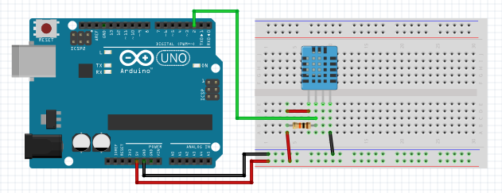
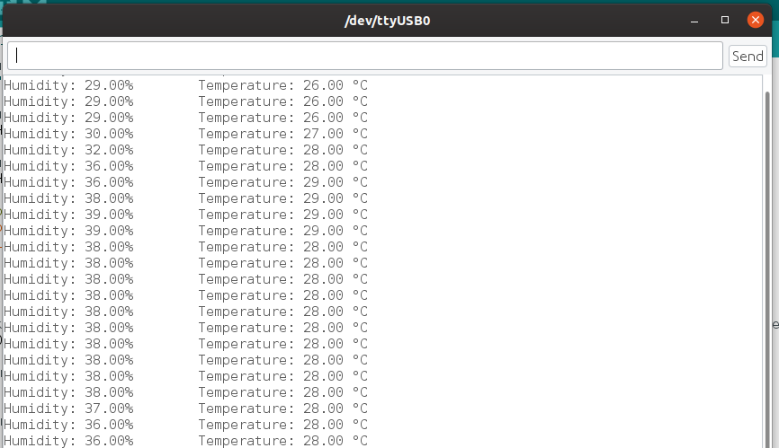

# Грудусник

## Нужные элементы

Датчики:

* [DHT-11](https://www.aliexpress.com/item/33005500534.html)
* [DHT-11 в готовом модуле](https://ru.aliexpress.com/item/1059518033.html)
* [DHT-22](https://ru.aliexpress.com/item/33052251953.html)

## Описание датчика

Датчик DHT-NN измеряет температуру и влажность

Датчик DHT-11:

* определение влажности в диапазоне 20-80%
* определение температуры от 0°C до +50°C
* частота опроса 1 раз в секунду

Датчик DHT-22:

* определение влажности в диапазоне 0-100%
* определение температуры от -40°C до +125°C
* частота опроса 1 раз в 2 секунды

У меня имеется датчик DHT-11, но работа с такими типами датчиков не отличается. Датчики DHT имеют 4 вывода:

* питание.
* вывод данных
* не используется.
* GND (земля).

ыМежду выводами питания и вывода данных нужно разместить резистор номиналом 10 кОм. Датчик DHT часто продается в виде готового модуля. В этом случае он имеет три вывода и подключается без резистора, т.к. резистор уже есть на плате.

Схема подключения датчика с резистором:



Сопротивление подключенные таким образом называется "подтягивающий" и оно предназначено для выставления определенного состояния 0 или 5. При отсутствии такого резистора схема может подучат наводки и изменять напряжение в большую или меньшую сторону. Из-за этого мы можем получить ошибки в работе нашей системы.

После подключения и соединения всех элементов нужно написать немного кода.

## Написание кода

Для работы с датчиком DHT имеется библиотека, которую можно установить из самой среды. Требуется зайти ```Scketch -> Include library -> Manage libraries``` и в окне менеджера найти библиотеку ```DHT sensor library```.

Теперь можно перейти к написанию кода

```c
// Подключение библиотеки для работы с датчиком
#include "DHT.h"

// Номер пина к которому подсоединен датчик
#define DHTPIN 2

// Создание объекта DHT
DHT dht(DHTPIN, DHT11);

void setup() {
  Serial.begin(9600);
  dht.begin();
}

void loop() {

  // Так как датчик DHT-11 можно опрашивать не чаще одного раза в секунду то выставляем задержку в одну секунды. Для датчика DHT-22 требуется задержка в 2 секунды
  delay(1000);
  
  // Считываем влажность
  float h = dht.readHumidity();
  
  // Считываем температуру
  float t = dht.readTemperature();
  
  // Проверяем успешность считывания данных
  if (isnan(h) || isnan(t)) {
    Serial.println("Не удается считать показания");
    return;
  }

  // Выводим показания в Serial Monitor
  Serial.print("Влажность: ");
  Serial.print(h);
  Serial.print("%\tТемпература: ");
  Serial.print(t);
  Serial.println(" °C");
}
```

Пришла пора загружать код на плату ```Sketch -> Upload``` и сразу после загрузки переходим в Serial Monitor для проверки работы нашего градусника ```Tools -> Serial Monitor```



Как изменить температуру думаю сообразите самостоятельно.

> Зайдя в очередной раз на официальный сайт arduino заметил интересную плату [Arduino Nano 33 BLE Sense](https://store.arduino.cc/usa/nano-33-ble-sense-with-headers). На данной плате уже имеется: акселерометр, гироскоп, компас, микрофон, датчик освещенности и цвета, барометр, датчик влажности и температуры. В довесок ко всему этому на плате имеется bluetooth версии 5.0
