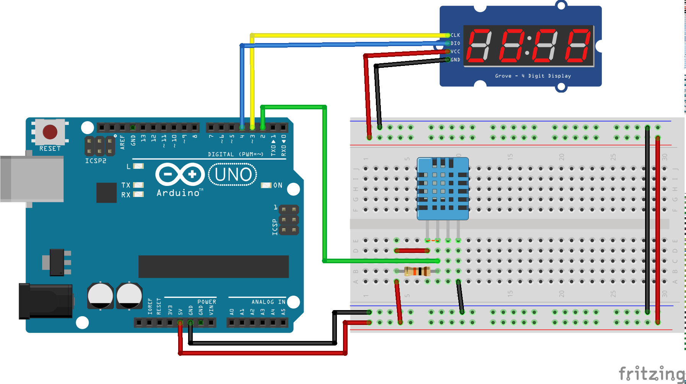

# Градусник с дисплеем

## Нужные элементы

Датчики:

* [DHT-11](https://www.aliexpress.com/item/33005500534.html)
* [DHT-11 в готовом модуле](https://ru.aliexpress.com/item/1059518033.html)
* [DHT-22](https://ru.aliexpress.com/item/33052251953.html)

Дисплей:

* [4х битный семи сегментный дисплей](https://ru.aliexpress.com/item/1969258031.html)

## Схема подключения

Как работать с датчиками DHT-NN разбирались в [статье чуть ранее](01-Thermometer.md).

Для подключения дисплея требуется задействовать ещё 2 пина.

Схема подключения датчика и дисплея:



## Написание кода

Для работы с дисплеем нам потребуется библиотека [TM1637](https://github.com/avishorp/TM1637), можно установить аналогичным способом или при использовании PlatformIO можно добавить в файл ```platformio.ini``` зависимость от данной библиотеки и она будет скачена в автоматическом режиме.

```ini
lib_deps =
  https://github.com/avishorp/TM1637.git
```

Теперь пришло время доработать наш код и добавить отображение температуры на дисплей

```c
#include "DHT.h"

// Подключаем библиотеку для работы с дисплеем
#include <TM1637Display.h>

#define DHTPIN 2

// Номера пинов которые будут использоваться для работы с дисплеем
#define CLKPIN 3
#define DIOPIN 4

DHT dht(DHTPIN, DHT11);

// Создание объекта для работы с дисплеем
TM1637Display display(CLKPIN, DIOPIN);

// Объявляем наличие собственной процедуры
void setSegmentsFormatTemperature(int num);

// Реализуем функцию по форматированию числа в температуру, для красивого отображения
void setSegmentsFormatTemperature(int num) {
  uint8_t data[] = {0x00, 0x00, 0x63, 0x39};

  for (int i = 1; i >= 0; --i) {
    uint8_t digit = num % 10;

    if (digit == 0 && num == 0)
    data[i] = 0;
    else
    data[i] = display.encodeDigit(digit);

    num /= 10;
  }

  display.setSegments(data);
}

void setup() {
  Serial.begin(9600);
  dht.begin();

  // Выставляем яркость на самый минимум
  // Допустимые значения от 0 до 7
  display.setBrightness(0);
}

void loop() {
  delay(2000);
  float h = dht.readHumidity();
  float t = dht.readTemperature();
  if (isnan(h) || isnan(t)) {
    Serial.println("Не удается считать показания");
    return;
  }

  //Выведем полученное значение температуры на наш дисплей
  setSegmentsFormatTemperature((int) t);
  Serial.print("Влажность: ");
  Serial.print(h);
  Serial.print("%\tТемпература: ");
  Serial.print(t);
  Serial.println(" °C");
}
```

Загружаем нашу поделку на плату и радуемся тому как работает наш градусник.
У меня получилось это как то так


