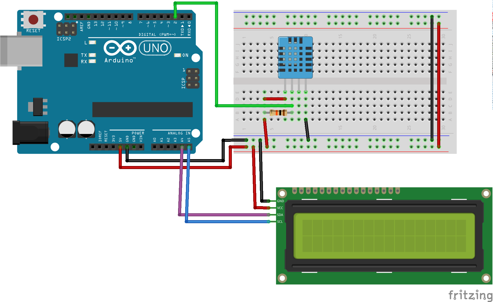

# Грудусник с LCD дисплеем

## Нужные элементы

Датчики:

* [DHT-11](https://www.aliexpress.com/item/33005500534.html?spm=a2g0o.productlist.0.0.64f25d39hXA0pY&algo_pvid=d4cc7b7e-71d9-4f4d-be1e-cd2dd71ed522&algo_expid=d4cc7b7e-71d9-4f4d-be1e-cd2dd71ed522-0&btsid=9f479f34-2398-411a-a638-03b82ab7107b&ws_ab_test=searchweb0_0,searchweb201602_2,searchweb201603_52)
* [DHT-11 в готовом модуле](https://ru.aliexpress.com/item/1059518033.html?spm=a2g0o.productlist.0.0.64f25d39hXA0pY&algo_pvid=d4cc7b7e-71d9-4f4d-be1e-cd2dd71ed522&algo_expid=d4cc7b7e-71d9-4f4d-be1e-cd2dd71ed522-2&btsid=9f479f34-2398-411a-a638-03b82ab7107b&ws_ab_test=searchweb0_0,searchweb201602_2,searchweb201603_52)
* [DHT-22](https://ru.aliexpress.com/item/33052251953.html?spm=a2g0o.productlist.0.0.6a7057e9d2r9lk&algo_pvid=b3d264de-1c69-42ec-8367-d6f398f48aa9&algo_expid=b3d264de-1c69-42ec-8367-d6f398f48aa9-1&btsid=0d424122-1704-4e4b-8880-440eae08cafc&ws_ab_test=searchweb0_0,searchweb201602_2,searchweb201603_52)

Дисплей:

* [LCD дисплей 2x16](https://www.aliexpress.com/item/32786773241.html?spm=a2g0o.productlist.0.0.6a3c5eeaW9FyOP&algo_pvid=969cc33b-ba78-4e4d-ab00-314975dcee6f&algo_expid=969cc33b-ba78-4e4d-ab00-314975dcee6f-0&btsid=28b711f5-a44e-4516-8ce6-e30e7647b981&ws_ab_test=searchweb0_0,searchweb201602_2,searchweb201603_53)
* [LCD дисплей 4x20](https://www.aliexpress.com/item/32831845529.html?spm=a2g0o.productlist.0.0.3cb94c5cqjEtYx&algo_pvid=fac01793-ba9e-4828-8622-20656b3bc636&algo_expid=fac01793-ba9e-4828-8622-20656b3bc636-0&btsid=c127af0d-0cab-47a7-8273-c0c816bcefb1&ws_ab_test=searchweb0_0,searchweb201602_2,searchweb201603_53)
* [I2C модуль для дисплея](https://www.aliexpress.com/item/32984942286.html?spm=a2g0o.productlist.0.0.b1347106ykhhyj&algo_pvid=bc84239b-1ecd-4cac-a21e-488319cf4197&algo_expid=bc84239b-1ecd-4cac-a21e-488319cf4197-5&btsid=ec94fe4f-c113-4e95-8581-c0c807952e1e&ws_ab_test=searchweb0_0,searchweb201602_2,searchweb201603_53)

Рекомендую сразу брать дисплей с уже припаянным I2C модулей, выйдет дешевле и не надо будет поять

## Схема подключения

Как работать с датчиками DHT-NN разбирались в [статье чуть ранее](01-Thermometer.md).

Для подлючения дисплея будем использовать подключение по [I2C](https://en.wikipedia.org/wiki/I%C2%B2C), для тех кому википедии не достаточно, то есть [видео](https://www.youtube.com/watch?v=_4KD29qnhNM)

Для разных плат могут использовать разные порты, для более детальной информации нужно смотреть описание платы. Вот небольшой перечень распрастраненных плат

|Наименование платы|SDA|SCL|
|---|:-:|:-:|
|Arduino Uno|A4|A5|
|Arduino Nano|A4|A5|
|Arduino Micro|2|3|
|Arduino Mega 2560|20|21|
|Arduino Leonardo|2|3|
|Arduino Due|20|21|
|ESP-12E (8266)|D2|D1|

Схема подключения датчика и дисплея:



## Написание кода

Для работы с LCD дисплеем нам потребуется библиотека [LiquidCrystal_I2C](https://github.com/johnrickman/LiquidCrystal_I2C.git), можно установить аналогичным способом или при использовании PlatformIO можно добавить в файл ```platformio.ini``` зависимость от данной библиотеки и она будет скачена в автоматическом режиме.

```ini
lib_deps =
    https://github.com/johnrickman/LiquidCrystal_I2C.git
```

Теперь пришло время доработать наш код и добавить отображение температуры на дисплей

```cpp
#include <Arduino.h>

#include <DHT.h>
#include <LiquidCrystal_I2C.h>

DHT dht(2, DHT11);
LiquidCrystal_I2C lcd(0x27,16,2);  

byte tempChar[] = {0x07,0x05,0x07,0x00,0x00,0x00,0x00,0x00};

void setup() {
    Serial.begin(9600);
    dht.begin();

    lcd.init();
    lcd.backlight();
    lcd.createChar(0, tempChar);
}

void loop() {
    delay(1000);

    float h = dht.readHumidity();
    float t = dht.readTemperature();
    if (isnan(h) || isnan(t)) {
        Serial.println("Не удается считать показания");
        return;
    }

    //Выводим показания на дисплей
    lcd.setCursor(0,0);
    lcd.print("Humidity: " + String(h) + "%");
    lcd.setCursor(0,1);
    lcd.print("Temp: "+ String(t) + "  C");
    lcd.setCursor(12, 1);
    lcd.write(0);

    Serial.print("Влажность: ");
    Serial.print(h);
    Serial.print("%\tТемпература: ");
    Serial.print(t);
    Serial.println(" °C");
}
```

Загрушаем прошивку на плату и проверям работу. Примерно вот так это выглядит у меня

