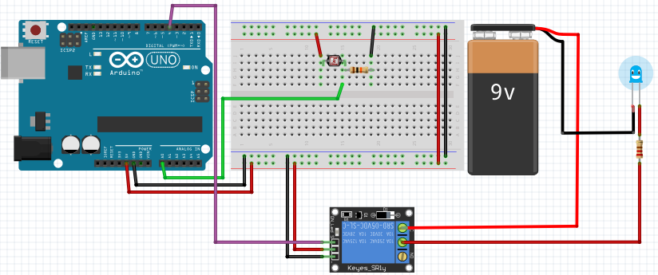

# Светочувствительная розетка

Из предыдущих статей мы узнали как работать с [датчиком освещённости](02-light-sensor.md) и [реле](02-relay.md). Каких либо новых элементов нам не понадобится.

## Схема подключения

Для реализации задуманного, нам нужно объеденить схемы



При создании такой схемы требуется учесть показатели при которых может работать реле.

## Написание кода

В этом коде добавилось только условие, на которое будет реагировать наше реле.

```cpp

const int RelayPin = 4;
const int LightSensorPin = A0;

void setup() {
  Serial.begin(9600);

  pinMode(LightSensorPin, INPUT);
  pinMode(RelayPin, OUTPUT);
  digitalWrite(RelayPin, LOW);
}
void loop() {
  int lightCount = analogRead(LightSensorPin);
  Serial.println(lightCount);

  if (lightCount < 300) {
    digitalWrite(RelayPin, HIGH);
  } else {
    digitalWrite(RelayPin, LOW);
  }
}
```

Если данный код будет работать наоборот, то можно изменить условие на противоположное. Данное поведение зависит от типа реле (низкоуровневое или высокоуровневое). На некоторых реле есть дополнительный переключатель в виде джампера (jumper pins) который позволяет менять состояние тип реле.