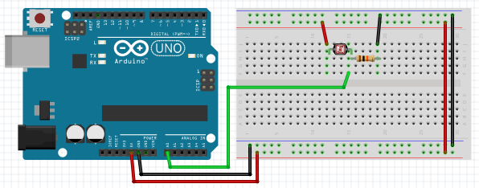

# Датчик освещенности

## Нужные элементы

[Фоторезистор](https://www.aliexpress.com/item/32760631393.html)

## Схема подключения

Светочувствительный резистор мы будем использовать как аналоговый прибор. Соответственно схема подключения немного измениться.



Показания датчика будем снимать с пина ```A0```, остальное подключение датчика остается прежним, через подтягивающий резистов.

## Написание кода

Код данного проекта не потребует от нас какой либо дополнительной библиотеки. Все необходимые действия сделает наш чип.

```cpp
void setup() {
  Serial.begin(9600);

  // Устанавливаем пин A0 на чтение сигнала
  pinMode(A0, INPUT);
}

void loop() {
  // Читаем информацию с аналогового пина
  int lightCount = analogRead(A0);

  // Выводим показания в Serial Monitor
  Serial.println(lightCount);
  delay(200);
}
```

У меня показания колеблется от 100 до 900. опытным путем можно определить когда для вас темно, когда светло и сделать необходимые заметки.
