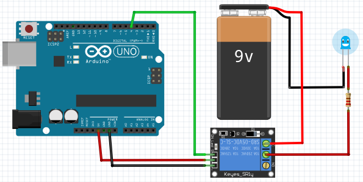
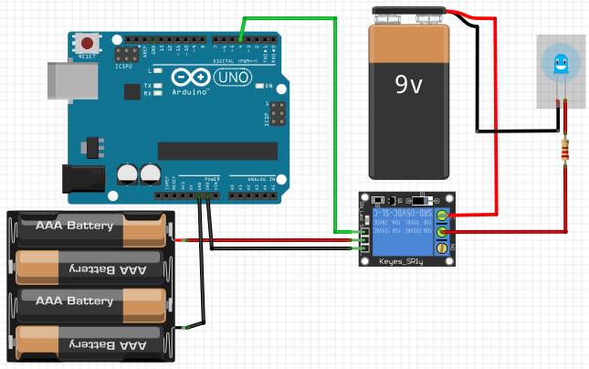

# Датчик освещенности

## Необходимые элементы

* [Механическое реле](https://www.aliexpress.com/item/32649659086.html) в зависимости от питания на выбираем нужную на 5v или на 12v
* [Твердотельное реле](https://www.aliexpress.com/item/32727486514.html)

> Имеются уже готовые платы работающие по определенному алгоритму:
>
> * [Реле с пультом управления](https://www.aliexpress.com/item/32815655353.html)
> * [Реле с WiFi](https://www.aliexpress.com/item/32821721218.html)
> * [Реле с датчиком освещенности](https://www.aliexpress.com/item/33042509591.html)
> * [Реле с радио пультом](https://www.aliexpress.com/item/4000152566528.html)
>
> Все эти вещи можно собрать самостоятельно с блэкджеком и микроконтроллером.

У механического реле есть ряд недостатков: оно щелкает при переключении, при использовании большой нагрузки реле может залипнуть и при отключении оно может не произвести отключение, оно имеет ограничение по переключению. Имеются и другие типы реле, такие как [твердотельное реле](https://www.aliexpress.com/item/32706812752.html) оно практически вечное и лишено недостатков механического реле.

## Схема подключения

Подключать можно к любому цифровому пину, я выбрал 4й пин



Эта схема подключения имеет недостаток, так как реле питается от платы. Механические реле рекомендуется запитывать от внешнего источника питания.



При таком подключении обязательно минус всех источников питания должен быть соединенным.

## Написание кода

Код который мы будем писать, ничем не будет отличаться от стандартного приложения [Blink](https://www.arduino.cc/en/Tutorial/Blink)

```cpp
const int RelayPin = 4;

void setup() {
  pinMode(RelayPin, OUTPUT);
  digitalWrite(RelayPin, LOW);
}

void loop() {
  digitalWrite(RelayPin, HIGH);
  delay(3000);
  digitalWrite(RelayPin, LOW);
  delay(3000);
}
```
