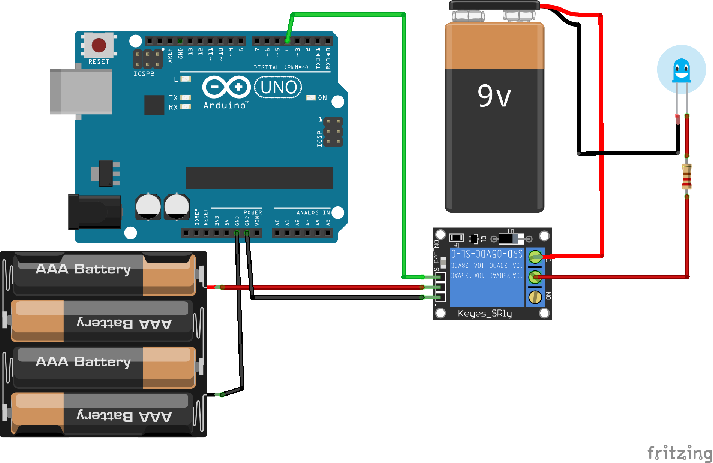

# Датчик освещенности

## Необходимые элементы

* [Механическое реле](https://www.aliexpress.com/item/32649659086.html?spm=a2g0o.productlist.0.0.51513030mv7tH9&algo_pvid=f2bb8f75-55e4-4fb6-bf7e-642d68507438&algo_expid=f2bb8f75-55e4-4fb6-bf7e-642d68507438-0&btsid=fcca0ded-ad0b-4291-ae2f-d028093e22cd&ws_ab_test=searchweb0_0,searchweb201602_2,searchweb201603_53) в зависимости от питания на выбираем нужную на 5v или на 12v
* [Твердотельное реле](https://www.aliexpress.com/item/32727486514.html?spm=a2g0o.productlist.0.0.193b1bddtlBtUK&algo_pvid=8166778f-b963-46fa-bb9c-686c7c640a3e&algo_expid=8166778f-b963-46fa-bb9c-686c7c640a3e-1&btsid=8d7a127d-daaf-4b81-ae4b-0314462b92f8&ws_ab_test=searchweb0_0,searchweb201602_2,searchweb201603_53)

> Имеются уже готовые платы работающие по определенному алгоритму:
>
> * [Реле с пультом управления](https://www.aliexpress.com/item/32815655353.html?spm=a2g0o.productlist.0.0.51513030mv7tH9&algo_pvid=f2bb8f75-55e4-4fb6-bf7e-642d68507438&algo_expid=f2bb8f75-55e4-4fb6-bf7e-642d68507438-27&btsid=fcca0ded-ad0b-4291-ae2f-d028093e22cd&ws_ab_test=searchweb0_0,searchweb201602_2,searchweb201603_53)
> * [Реле с WiFi](https://www.aliexpress.com/item/32821721218.html?spm=a2g0o.productlist.0.0.51513030mv7tH9&algo_pvid=f2bb8f75-55e4-4fb6-bf7e-642d68507438&algo_expid=f2bb8f75-55e4-4fb6-bf7e-642d68507438-36&btsid=fcca0ded-ad0b-4291-ae2f-d028093e22cd&ws_ab_test=searchweb0_0,searchweb201602_2,searchweb201603_53)
> * [Реле с дастчиком освещенности](https://www.aliexpress.com/item/33042509591.html?spm=a2g0o.productlist.0.0.51513030mv7tH9&algo_pvid=f2bb8f75-55e4-4fb6-bf7e-642d68507438&algo_expid=f2bb8f75-55e4-4fb6-bf7e-642d68507438-37&btsid=fcca0ded-ad0b-4291-ae2f-d028093e22cd&ws_ab_test=searchweb0_0,searchweb201602_2,searchweb201603_53)
> * [Реле с радио пультом](https://www.aliexpress.com/item/4000152566528.html?spm=a2g0o.productlist.0.0.51513030mv7tH9&s=p&algo_pvid=f2bb8f75-55e4-4fb6-bf7e-642d68507438&algo_expid=f2bb8f75-55e4-4fb6-bf7e-642d68507438-41&btsid=fcca0ded-ad0b-4291-ae2f-d028093e22cd&ws_ab_test=searchweb0_0,searchweb201602_2,searchweb201603_53)
>
> Все эти веши можно собрать самостоятельно с блэкджеком и микроконтроллером.

У механического реле есть ряд недостатков: она щелкает при переключении, при использовании большой нагрузки реле может залипнуть и при отключении оно может не произвести отключение, оно имеет ограничение по переключени. Имеются и другие типы реле, такие как [твердотельное реле](https://www.aliexpress.com/item/32706812752.html?spm=a2g0o.productlist.0.0.193b1bddtlBtUK&algo_pvid=8166778f-b963-46fa-bb9c-686c7c640a3e&algo_expid=8166778f-b963-46fa-bb9c-686c7c640a3e-3&btsid=8d7a127d-daaf-4b81-ae4b-0314462b92f8&ws_ab_test=searchweb0_0,searchweb201602_2,searchweb201603_53) оно практически вечное и лишено недостатков механического реле.

## Схема подключения

Подключать можно к любому цифровому пину, я выбрал 4й пин


Эта схема подключения имеет недостаток, так как реле питается от платы и очень энерноемкая. Механические реле рекомендуется запитывать от внешнего источника питания.



При таком подключении обязательно минус всех источников питания должен быть соединенным.

## Написание кода

Код который мы будем писать, ничем не будет отличаться от стандартного приложения [Blink](https://www.arduino.cc/en/Tutorial/Blink)

```cpp
const int RelayPin = 4;

void setup() {
  pinMode(RelayPin, OUTPUT);
  digitalWrite(RelayPin, LOW);
}
void loop() {
  digitalWrite(RelayPin, HIGH);
  delay(3000);
  
  digitalWrite(RelayPin, LOW);
  delay(3000);
}
```
