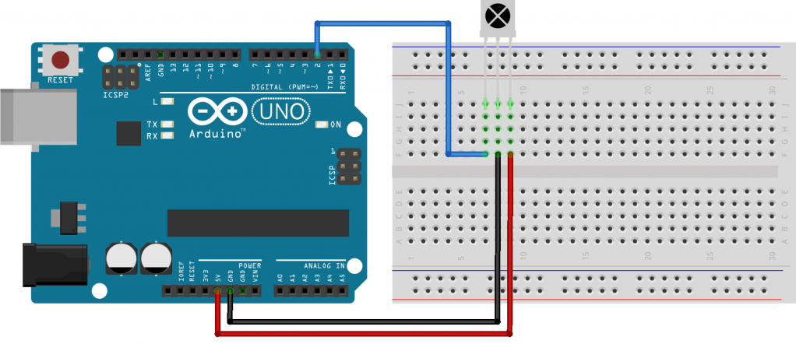
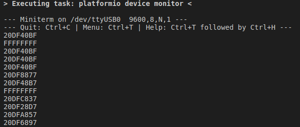

# Приемник инфракасных сигралов

## Необходимые элементы

* [Приемник IR сигналов](https://www.aliexpress.com/item/33022813566.html?spm=a2g0o.productlist.0.0.4e0c32e8xl2kvp&algo_pvid=0bbf528b-800f-402e-b288-d14933f857a4&algo_expid=0bbf528b-800f-402e-b288-d14933f857a4-0&btsid=d5651d98-23e9-4d4a-8264-3e4a2de72d5a&ws_ab_test=searchweb0_0,searchweb201602_2,searchweb201603_53)

## Схема подключения

Подключать можно к любому цифровому пину



## Написание кода

Для получения кодов нам потребуется библиотека [IRremote](https://github.com/z3t0/Arduino-IRremote.git). Попробуем набрасать небольшой код читающий коды от пульта (к примеру от TV)

```cpp
#include <IRremote.h>

IRrecv irrecv(2);

decode_results results;

void setup(){
  Serial.begin(9600);
  irrecv.enableIRIn(); // запускаем прием
}

void loop(){
  // если данные пришли
  if (irrecv.decode(&results)) {
    // выводим полученное значение
    Serial.println( results.value, HEX );
    // принимаем следующую команду
    irrecv.resume();
  }
}
```

При запуске и нажатии различных кнопок на пульте в Serial Monitor будет отображаться различные коды.



После получения нужных кодов, я взял два кода увеличение громкости и уменьшение. При увеличении я буду зажигать дион на плате, при уменьшение отключать. Далее остается только модернизировать код следующим образом:

```cpp
#include <IRremote.h>

IRrecv irrecv(3);

decode_results results;

void setup(){
  Serial.begin(9600);
  irrecv.enableIRIn(); // запускаем прием
}

void loop(){
  if (irrecv.decode(&results)) { // если данные пришли

    Serial.println( results.value, HEX ); // выводим полученное значение

    switch ( results.value ) {
        case 0x20DF40BF:
            digitalWrite( 13, HIGH );
            break;
        case 0x20DFC03F:
            digitalWrite( 13, LOW );
            break;
    }

    irrecv.resume(); // принимаем следующую команду
  }
}
```

> В качестве домашнего задания можно сделать включение и отключение 3х цветного диода при нажатии на кнопки 1,2,3.
> Отдельно задание на логику, хранить состояние пинов на которых работают счетодиоды в отдельных переменных **нельзя**
