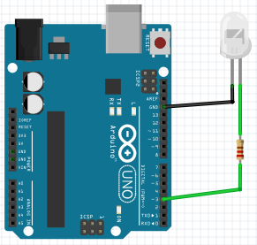

# Передача инфракасных сигралов

## Необходимые элементы

* [Светодиод в инфракрасном диапазоне](https://www.aliexpress.com/item/32801162685.html?spm=a2g0o.productlist.0.0.1f733cdfkxo8dK&algo_pvid=d323dac5-97d9-40ac-8865-0366727b8ad9&algo_expid=d323dac5-97d9-40ac-8865-0366727b8ad9-5&btsid=dd408097-f078-4490-b20b-ec96c0d39070&ws_ab_test=searchweb0_0,searchweb201602_2,searchweb201603_53)

## Схема подключения

Способ соединения простой до нельзя. Нам понядобится только светодиод и резистор на 220 Ом. Резисторы отличаются цветовой маркировкой, для определения наминала я использую [калькулятор](https://www.allaboutcircuits.com/tools/resistor-color-code-calculator/) или какой-то иной который найдет мне гугл =)



## Написание кода

Код включения телевизора ```20DF10EF```, поэтому будем включать и выключать телевизор. У библиотеки [IRremote](https://github.com/z3t0/Arduino-IRremote.git) в режиме передачи есть одна особонность, светодиод обязательно подключается к 3му пину.

```cpp
#include <IRremote.h>

IRsend irsend;

void setup()
{
}

void loop()
{
  irsend.sendLG(0x20DF10EF, 32);
  delay(20000);
}
```

Для большинства популярной техники уже имеются необходимые функции. Они в себе сожержат уже все необходимые параметры для передачи сиграли. Если кто не найдет своей техники, то можно воспользоваться фукцией ```sendRaw```.
