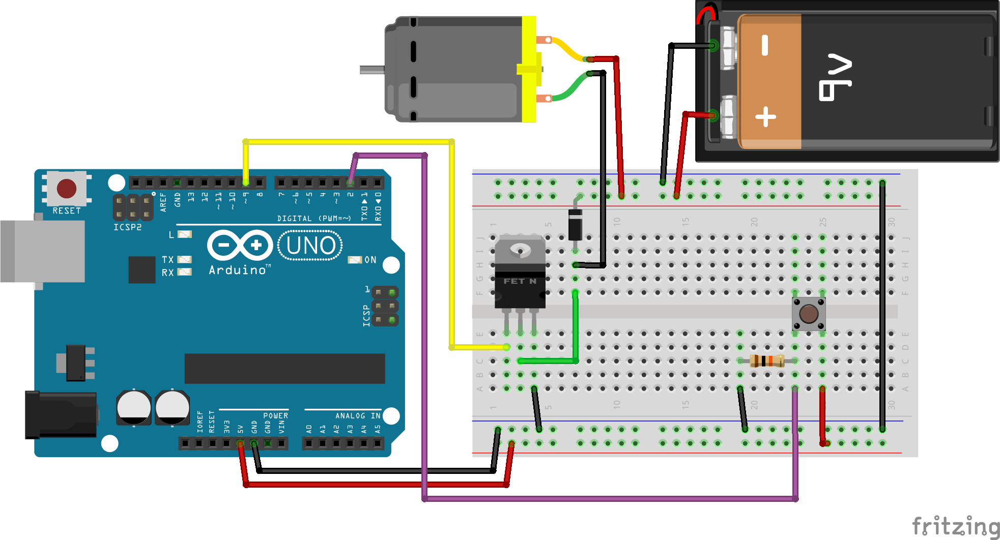
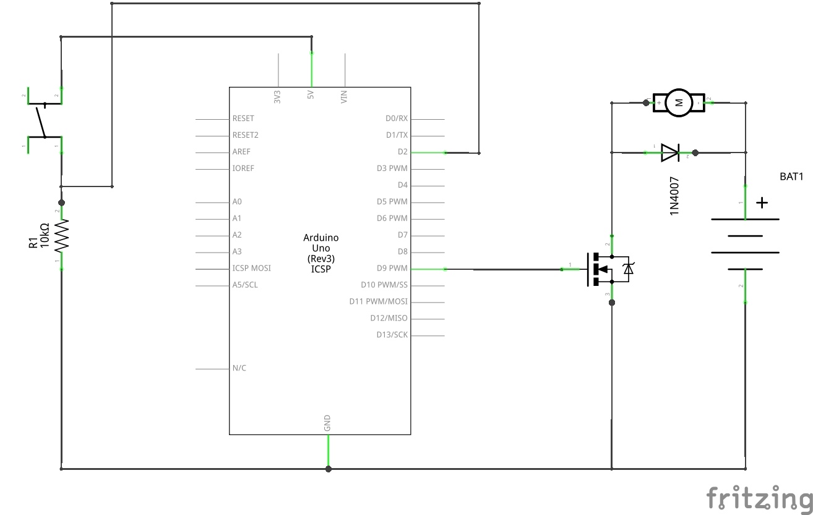

# Работа с мотором

## Необходимые элементы

* [Мотор](https://www.aliexpress.com/item/33048234286.html) они бывают разные, для примера я взял мотор на 9V
* Мосфет или иначе говоря, полевой транзистор [IRF520](https://www.aliexpress.com/item/32867857750.html)
* Диод [1N4007](https://www.aliexpress.com/item/32224555821.html)

## Схема подключения

В данной схеме рассмотрим 3й вариант управления нагрузкой.





Почему были взяты именно эти элементы? Они у меня были

### Транзистор

Было решено управлять "минусом" мотора и для этого нам нужен [транзистор](http://wiki.amperka.ru/%D1%81%D1%85%D0%B5%D0%BC%D0%BE%D1%82%D0%B5%D1%85%D0%BD%D0%B8%D0%BA%D0%B0:%D1%82%D1%80%D0%B0%D0%BD%D0%B7%D0%B8%D1%81%D1%82%D0%BE%D1%80%D1%8B) N-типа. IRF520 считается одним из самых популярных транзисторов в схемотехнике из-за своих [показателей](https://www.vishay.com/docs/91017/91017.pdf), он может пропускать через себя токи 6,5-9А (зависит от температуры) и напряжение до 100V, что покрывает наши потребности более чем. По факту можно использовать и другой транзистор из этого семейства [IRF840](http://www.alphacron.de/download/hardware/IRF840.pdf), он может уже пропускает напряжение до 500V и силе тока до 8А. Поэтому исходим из задачи и имеющихся элементов выбор пал на него.

Данную задачу можно реализовать и при использовании транзистора с P-типом, к примеру [IRF9520](https://www.futurlec.com/Datasheet/Transistor/IRF9520.pdf), показатели 100V и 6,8A. Но для этого потребуется переделать схему и данный транзистор ставить в разным на "положительном" контакте.

### Диод

[Диод](http://wiki.amperka.ru/%D0%BA%D0%BE%D0%BD%D1%81%D0%BF%D0%B5%D0%BA%D1%82-arduino:%D0%B4%D0%B8%D0%BE%D0%B4) является поляризованным компонентом и может проводить ток только в одном направлении. В данной схеме диод нам необходим для предотвращения обратного напряжения, генерируемого двигателем. В данной схеме можно использовать любой диод из семейства 1N400X, разница в них только в напряжении. Посмотреть можно и на другие семейства 1N53XX, 1N54XX. Все зависит от показателей вашей цепи.

> Очень часто на диодах 1n4007 собирают диодный мост

## Написание кода

```cpp
const int switchPin = 2;
const int motorPin = 9;
int switchState = 0;

void setup() {
    pinMode(motorPin, OUTPUT);
    pinMode(switchPin, INPUT);
}

void loop(){
    // Чтение состояния кнопки.
    switchState = digitalRead(switchPin);

    // Проверяем состояние кнопки
    if (switchState == HIGH) {
        // Подаем писание на мотор
        digitalWrite(motorPin, HIGH);
    } else {
        // Отключаем мотор
        digitalWrite(motorPin, LOW);
    }
}
```
