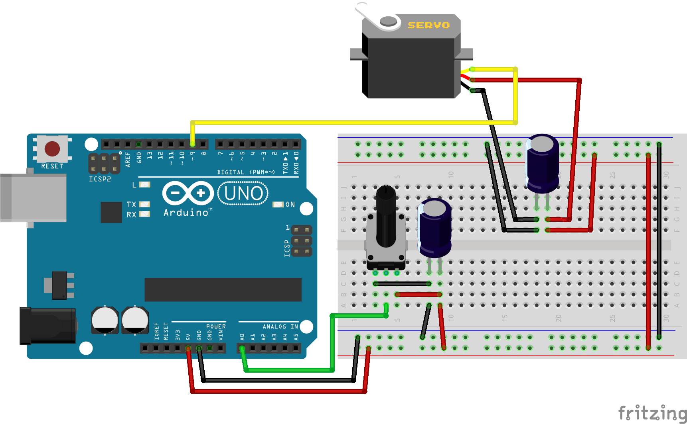
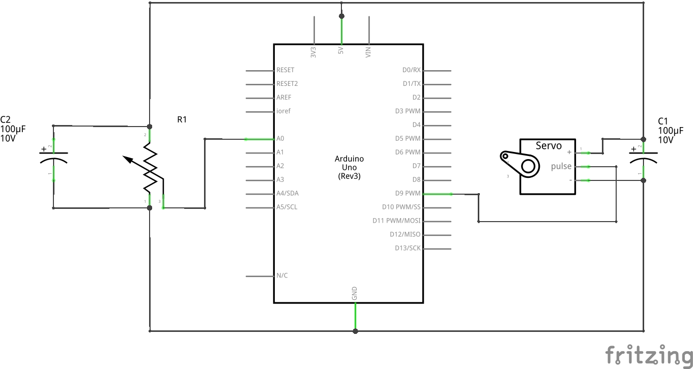

# Работа с сервой

## Необходимые элементы

* [Серво мотор](https://www.aliexpress.com/item/33040546279.html)
* [Конденсаторы](https://www.aliexpress.com/item/4000092084550.html) на 100 µF
* [Потенциометр](https://www.aliexpress.com/item/32986513037.html) можно взять на 10 кОм

## Схема подключения

В схеме у нас имеются конденсаторы номиналом 100µF, если брать электролитические конденсаторы, то при подключении нужно учитывать полярность.

На питании сервы установлен развязывающий конденсатор, они нужны для сглаживания падения напряжения, которое возникает при начале движения.



Для большего понятного оставлю принципиальную схему



## Написание кода

```cpp
// Подключаем библиотеку, она находится в среде Arduino IDE по умолчанию
#include <Servo.h>

Servo servo;

int const potPin = A0;
int potVal;
int angle;

void setup() {
    servo.attach(9);
    Serial.begin(9600);
}

void loop() {
    // Чтение значение с потенциометра
    potVal = analogRead(potPin);

    Serial.print("potVal: ");
    Serial.print(potVal);

    // Расчитываем угол на который необходимо повернуть серво
    // x - значение потенциометра
    // in_min - минимальное значение потенциометра
    // in_max - максимальное значение потенциометра
    // out_min - минимальный угол серво
    // out_max - максимальное угол серво
    angle = map(potVal, 0, 1023, 0, 179);

    Serial.print(", angle: ");
    Serial.println(angle);

    // Выставления угла на серво
    servo.write(angle);

    delay(15);
}
```
