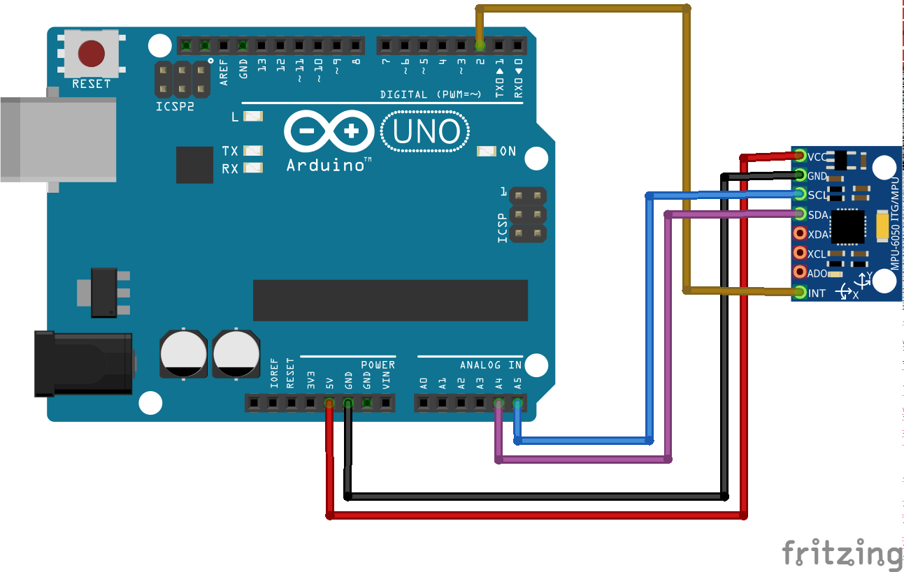

# Работа с гироскопом

## Необходимые элементы

* [MPU-6050](https://www.aliexpress.com/item/32527828492.html) рабочее напряжение датчика 3 - 5V. Этот датчек может маркироваться как GY-541
* [SparkFun - MPU-6050](https://www.sparkfun.com/products/11028) рабочее напряжение датчика 2.3 - 3.4V
* [GY-80](https://www.aliexpress.com/item/32787517636.html) этот датчик помимо акселерометра и гироскопа на борту имеет компас и датчик давления
* [GY-LSM6DS3](https://www.aliexpress.com/item/32839272499.html) датчик ещё может изменять температуру
* [GY-91](https://www.aliexpress.com/item/33023942649.html) датчик может измерять все. В нем имеется акселерометр, гироском, барометр и термоментр

> Для желающих собрать какую-то машинку, коптер или ещё какую технику уже есть готовая плата [ArduPilot](https://www.aliexpress.com/item/32891728823.html) которая на борту уже имеет гироскоп MPU-6000 и барометр MS5611. Компас и GPS к сожалению отсутствует на данной плате, но их можно подключить при такой необходимости.

## Схема подключения

Датчик MPU-6050 подключается по I2C порту (ранее мы уже подключали [дисплей по I2C порту](01p3-Termometer-i2c-lcd.md)). При подключении надо точно быть увеременным от скольки вольт питается данная плата. Часто встречаются платы работающие от 3.3V. Конкретно эта плата может работать от 3 до 5V. Поэтому если в схеме будет всплеск напряжения, то волшебный дым на котором работает вся электронника может выйти. При желании можно красный провод подключить к 3.3V.



При желании мы так же можем подключить и дисклей так же по порту I2C. Так как устройства имеют разные адреса, то можно подключить и дисплей или друние датчики работающие через I2C.

## Написание кода

```cpp
#include <Arduino.h>
#include "Wire.h"
#include "I2Cdev.h"
#include "MPU6050_6Axis_MotionApps20.h"

MPU6050 mpu(0x68);

#define INTERRUPT_PIN 2

// MPU control/status vars
bool dmpReady = false;          // set true if DMP init was successful
uint8_t mpuIntStatus;           // holds actual interrupt status byte from MPU
uint8_t dmpInitializeStatus;    // return status after each device operation (0 = success, !0 = error)
uint16_t packetSize;            // expected DMP packet size (default is 42 bytes)
uint16_t fifoCount;             // count of all bytes currently in FIFO
uint8_t fifoBuffer[64];         // FIFO storage buffer

// orientation/motion vars
Quaternion quaternionContainer; // quaternion container
VectorFloat gravity;            // gravity vector
float ypr[3];                   // yaw/pitch/roll container and gravity vector

int32_t temperature;

volatile bool mpuInterrupt = false; // indicates whether MPU interrupt pin has gone high
void dmpDataReady() {
    mpuInterrupt = true;
}

void setup() {
    Wire.begin();
    Wire.setClock(400000);  // 400kHz I2C clock.

    Serial.begin(9600);

    // initialize device
    Serial.println(F("Initializing I2C devices..."));
    mpu.initialize();
    pinMode(INTERRUPT_PIN, INPUT);

    // verify connection
    Serial.println(F("Testing device connections..."));
    Serial.println(mpu.testConnection() ? F("MPU6050 connection successful") : F("MPU6050 connection failed"));

    // load and configure the DMP
    Serial.println(F("Initializing DMP..."));
    dmpInitializeStatus = mpu.dmpInitialize();

    // make sure it worked (returns 0 if so)
    if (dmpInitializeStatus == 0) {
        // Calibration Time: generate offsets and calibrate our MPU6050
        mpu.CalibrateAccel(6);
        mpu.CalibrateGyro(6);
        mpu.PrintActiveOffsets();
        // turn on the DMP, now that it's ready
        Serial.println(F("Enabling DMP..."));
        mpu.setDMPEnabled(true);

        // enable Arduino interrupt detection
        Serial.print(F("Enabling interrupt detection (Arduino external interrupt "));
        Serial.print(digitalPinToInterrupt(INTERRUPT_PIN));
        Serial.println(F(")..."));
        attachInterrupt(digitalPinToInterrupt(INTERRUPT_PIN), dmpDataReady, RISING);
        mpuIntStatus = mpu.getIntStatus();

        // set our DMP Ready flag so the main loop() function knows it's okay to use it
        Serial.println(F("DMP ready! Waiting for first interrupt..."));
        dmpReady = true;

        // get expected DMP packet size for later comparison
        packetSize = mpu.dmpGetFIFOPacketSize();
    } else {
        // ERROR!
        // 1 = initial memory load failed
        // 2 = DMP configuration updates failed
        // (if it's going to break, usually the code will be 1)
        Serial.print(F("DMP Initialization failed (code "));
        Serial.print(dmpInitializeStatus);
        Serial.println(F(")"));
    }
}

void loop() {
    // if programming failed, don't try to do anything
    if (!dmpReady) return;

    // wait for MPU interrupt or extra packet(s) available
    while (!mpuInterrupt && fifoCount < packetSize) {
        if (mpuInterrupt && fifoCount < packetSize) {
          // try to get out of the infinite loop
          fifoCount = mpu.getFIFOCount();
        }  
    }

    // reset interrupt flag and get INT_STATUS byte
    mpuInterrupt = false;
    mpuIntStatus = mpu.getIntStatus();

    // get current FIFO count
    fifoCount = mpu.getFIFOCount();
    if(fifoCount < packetSize){
        //Lets go back and wait for another interrupt.
        // We shouldn't be here, we got an interrupt from another event
        // This is blocking so don't do it while (fifoCount < packetSize) fifoCount = mpu.getFIFOCount();
    }
    // check for overflow (this should never happen unless our code is too inefficient)
    else if ((mpuIntStatus & _BV(MPU6050_INTERRUPT_FIFO_OFLOW_BIT)) || fifoCount >= 1024) {
        // reset so we can continue cleanly
        mpu.resetFIFO();
        Serial.println(F("FIFO overflow!"));

    // otherwise, check for DMP data ready interrupt (this should happen frequently)
    } else if (mpuIntStatus & _BV(MPU6050_INTERRUPT_DMP_INT_BIT)) {

        // read a packet from FIFO
        while(fifoCount >= packetSize){ // Lets catch up to NOW, someone is using the dreaded delay()!
            mpu.getFIFOBytes(fifoBuffer, packetSize);
            // track FIFO count here in case there is > 1 packet available
            // (this lets us immediately read more without waiting for an interrupt)
            fifoCount -= packetSize;
        }

        // display Euler angles in degrees
        mpu.dmpGetQuaternion(&quaternionContainer, fifoBuffer);
        mpu.dmpGetGravity(&gravity, &quaternionContainer);
        mpu.dmpGetYawPitchRoll(ypr, &quaternionContainer, &gravity);

        Serial.print("Yaw: ");
        Serial.print(ypr[0] * 180/M_PI);
        Serial.print("\tPitch: ");
        Serial.print(ypr[1] * 180/M_PI);
        Serial.print("\tRoll: ");
        Serial.println(ypr[2] * 180/M_PI);
    }
}
```

Данный код будет выводить три основных показателя: крен, рысканье и тангаж.

Немного картинок, что есть что:

Крен (roll):


Рысканье (yaw)


Тангаж (pitch)


Цельная картина


> Все картинки честно взяты с википедии.

## Идеи применения

Очень часто этот датчик используется в авиомоделировании (для тех кто не понял по картинкам). Для автоматического выравнивания модели в воздухе. Так же можно сделать бота на 2х колесиках, который будет балансировать. Можно придумать ещё много всего где нужно измерять положение в пространстве.

> При использовании этого датчика с платой Arduino Leonardo можно получить внешнее устройство для компьютера.

Если нет желания покупать россыпь датчиков и думать как все объеденить, то уже все придумали и выпустили плату [Arduino Nano 33 BLE Sense](https://store.arduino.cc/usa/nano-33-ble-sense-with-headers). На данной плате уже имеется: акселерометр, гироскоп, компас, микрофон, датчик освещенности и цвета, барометр, датчик влажности и температуры. В довесок ко всему этому на плате имеется bluetooth версии 5.0 и серцем платы является ARM® Cortex®-M4 32-битный процессор работающий на частоте 64 MHz
