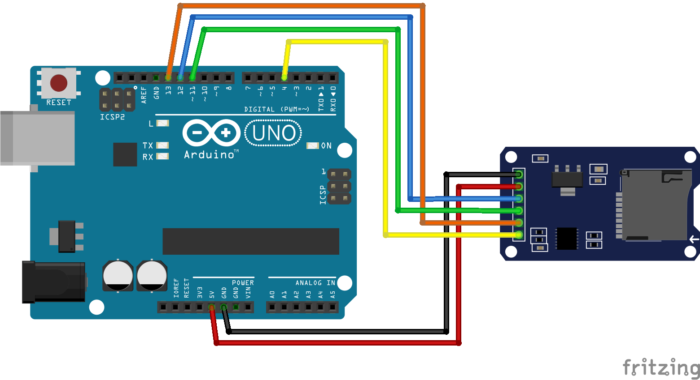

# Работа с SD картой (SPI bus)

Подключение будет выполняться по средствам шины SPI (Serial Peripheral Interface, SPI bus — последовательный периферийный интерфейс).

В SPI используются четыре цифровых сигнала:

* **MOSI** — выход ведущего, вход ведомого (англ. Master Out Slave In). Служит для передачи данных от ведущего устройства ведомому.
* **MISO** — вход ведущего, выход ведомого (англ. Master In Slave Out). Служит для передачи данных от ведомого устройства ведущему.
* **SCLK** или **SCK** — последовательный тактовый сигнал (англ. Serial Clock). Служит для передачи тактового сигнала для ведомых устройств.
* **CS** или **SS** — выбор микросхемы, выбор ведомого (англ. Chip Select, Slave Select). Не обязательный сигнал при подключении только одно устройства.

Конкретные имена портов интерфейса SPI могут различаться в зависимости от производителя аппаратных средств, при этом возможны следующие варианты:

* **MOSI**: SIMO, SDO (на устройстве), DO, DON, SO, MRSR;
* **MISO**: SOMI, SDI (на устройстве), DI, DIN, SI, MTST;
* **SCLK**: SCK, CLK, SPC (SPI serial port clock);
* **SS**: nCS, CS, CSB, CSN, nSS, STE, SYNC.

> Для желающих понять что это за шина и как она работает, то есть отличная [лекция](https://www.youtube.com/watch?v=85Lhi_824ks&t=67s) в которой рассказывается как работает SPI и для чего нужны все эти провода

## Необходимые элементы

* [MicroSD card adapter](https://www.aliexpress.com/item/32583289463.html)
* Часто MicroSD card adapter встречается на полноценных модулях к примеру на [Ethernet Shield](https://www.aliexpress.com/item/32549379444.html)
* Либо он уже есть на борту некоторых плат:
* [Arduino YÚN rev 2](https://store.arduino.cc/usa/arduino-yun-rev-2)
* [Arduino Ethernet](https://store.arduino.cc/usa/arduino-ethernet-rev3-with-poe)
* [Netduino 3 Ethernet/WiFi](https://www.wildernesslabs.co/netduino), скоро ожидается 4е поколение плат и можно писать код на dotnet core

## Схема подключения

|Наименование платы|MISO|MOSI|SCK|
|---|:-:|:-:|:-:|
|Arduino Uno|12|11|13|
|Arduino Nano|12|11|13|
|Arduino Micro|MISO|MOSI|SCK|
|Arduino Mega 2560|22|21|20|
|Arduino Leonardo|ICSP MISO|ICSP MOSI|ICSP SCK|
|ESP-12E (8266)|D6|D7|D5|

При отсутствии вашей платы в списке, то ищем какие порты на вашей плате отвечают за SPI.



## Написание кода

Подключаемые библиотеки уже имеются и дополнительно их устанавливать никак не требуется.

```cpp
#include <SPI.h>
#include "SD.h"

const uint8_t csPin = 4;
const String fileName = "TEMP.TXT";

File file;

void setup(){

  Serial.begin(9600);

  // ожидаем соединения
  while(!Serial){;}

  if(!SD.begin(csPin)){
    Serial.println("SD-card not found");
    return;
  }

  if(SD.exists(fileName)){
  Serial.println("=> file exist");
  }else{
  Serial.println("=> file doesn't exist");
  }

  file = SD.open(fileName, FILE_WRITE);
  file.println("Line");

  if (file){
    file.close();
  }
}

void loop(){

}
```

> Я использовал карту на 1 Gb, перед работай отформатировал в FAT32.

Если кто думает о работе с файлами как о способе хранения информации, то для этого есть великолепная структура ```JSON```. [Библиотека](https://github.com/bblanchon/ArduinoJson) по работе уже создана и велосипед изобретать не надо.

```cpp
#include <ArduinoJson.h>

void ReadDataFromJson(String jsonLine){
  DynamicJsonBuffer jsonBuffer;
  JsonObject& rp = jsonBuffer.parseObject(jsonLine);

  if (rp.success())
  {
    String strColor = rp["StringParam"];
    int interval = rp["IntParam"];
  }
}
```
