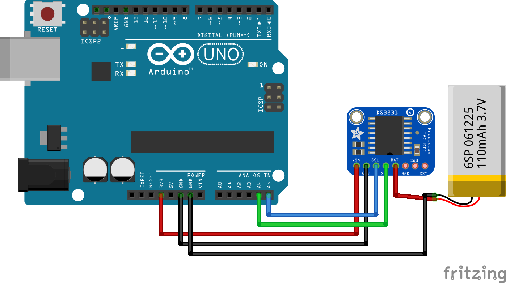
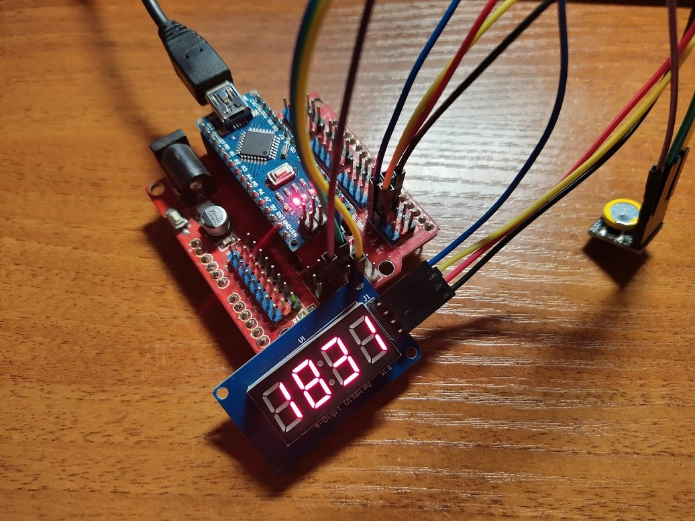
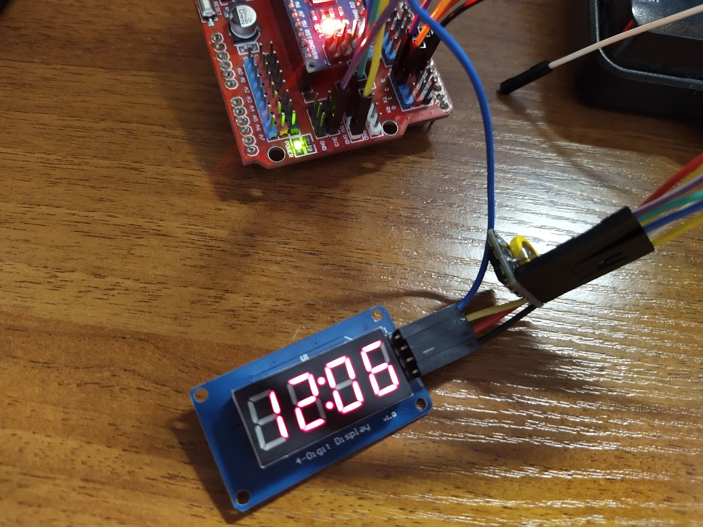

# Работа с датчиком реального времени

## Необходимые элементв

* Часы реального времени (RTC). Вариаций датчиков очень много
* [DS1302](https://ru.aliexpress.com/item/32861729429.html)
* [DS1307](https://ru.aliexpress.com/item/32443265169.html)
* [DS3231](https://ru.aliexpress.com/item/32666603579.html)
* [DS3231](https://ru.aliexpress.com/item/1954150922.html) в компактном корпусе
* [Arduino Nano Shield](https://ru.aliexpress.com/item/32845808016.html) с датчиком DS1307 и адаптером SD карт
* [PCF8523](https://ru.aliexpress.com/item/33014387417.html)

Основные отличия этих датчиков: температурный диапазон, скорость отставания, рабочее напряжение. Более детально можно посмотреть в описании чипов: [DS1302](https://datasheets.maximintegrated.com/en/ds/DS1302.pdf), [DS1307](https://datasheets.maximintegrated.com/en/ds/DS1307.pdf), [DS3231](https://datasheets.maximintegrated.com/en/ds/DS3231.pdf). Другие документы найдите самостоятельно

## Схема подключения

Схема подключения через шину I2C, уже рассматривалась ранее.



На некоторых датчиках уже имеется батарейка или же порт для подключения батарейки. Она нужна для работы датчика времени при отсутствии внешнего питания. Напряжение батарейки для датчика DS3231 может колебаться между 2,3 - 5,5V. Для других чипов нужно смотреть в документации.

## Написание кода

Для начала попробуем вывести время с нашего датчика.

```cpp
#include <Wire.h>
#include "DS1307RTC.h"
#include "Time.h"

tmElements_t datetime;

String formatDateTime(tmElements_t &datetime);
String formatValue(unsigned int nn);

void setup() {
    Serial.begin(9600);
}

void loop() {
    if (RTC.read(datetime)) {
        Serial.println(formatDateTime(datetime));
    } else {
        Serial.println("error");
    }
}

String formatDateTime(tmElements_t &datetime){
    String result = "";

    result += formatValue(datetime.Hour);
    result += ":";
    result += formatValue(datetime.Minute);
    result += ":";
    result += formatValue(datetime.Second);
    result += " ";
    result += formatValue(datetime.Day);
    result += ".";
    result += formatValue(datetime.Month);
    result += ".";
    result += formatValue(tmYearToCalendar(datetime.Year));

    return result;
}

String formatValue(unsigned int nn) {
    String result = "";

    if (nn >= 0 && nn < 10)
        result += "0";

    result += String(nn);

    return result;
}
```

Чаще всего новый датчик показывает неверное время и нужно указать то время которое нам требуется. Потребуется доработать код и начать получать время с Serial Monitor.

```cpp
#include <Wire.h>
#include "DS1307RTC.h"
#include "Time.h"

String dateTimeStr = "";
boolean strFull = false;
tmElements_t datetime;

String formatDateTime(tmElements_t &datetime);
String formatValue(unsigned int nn);

void setup() {
    Serial.begin(9600);
}

void loop() {
    if (strFull) {
        // Порсим строку и вытаемся получить из неё необходимые значения
        dateTime.Hour = dateTimeStr.substring(11,13).toInt();
        dateTime.Minute = dateTimeStr.substring(14,16).toInt();
        dateTime.Second = dateTimeStr.substring(17,19).toInt();
        dateTime.Day = dateTimeStr.substring(0,2).toInt();
        dateTime.Month = dateTimeStr.substring(3,5).toInt();
        dateTime.Year = CalendarYrToTm(dateTimeStr.substring(6,10).toInt());

        // запишем данные в DS3231
        RTC.write(datetime);

        // очистить строку
        dateTimeStr = "";
        strFull = false;
    }

    // получение данных из ds3231
    if (RTC.read(datetime)) {
        Serial.println(formatDateTime(datetime));
    } else {
        Serial.println("error");
    }

    delay(500);
}

void serialEvent() {
    while (Serial.available()) {
        // получить очередной байт:
        char c = (char)Serial.read();

        // добавить в строку
        dateTimeStr += c;

        // /n - конец передачи
        if (c == '\n')
        {
            strFull = true;
        }
    }
}

String formatDateTime(tmElements_t &datetime){
    String result = "";

    result += formatValue(datetime.Hour);
    result += ":";
    result += formatValue(datetime.Minute);
    result += ":";
    result += formatValue(datetime.Second);
    result += " ";
    result += formatValue(datetime.Day);
    result += ".";
    result += formatValue(datetime.Month);
    result += ".";
    result += formatValue(tmYearToCalendar(datetime.Year));

    return result;
}

String formatValue(unsigned int nn) {
    String result = "";

    if (nn >= 0 && nn < 10)
        result += "0";

    result += String(nn);

    return result;
}
```

Теперь мы можем зайти в Serial Monitor и указать нужное время в формате ```dd.MM.yyyy HH:mm:ss``` после чего его нужно передать на устройство.

## Вывод на дисплей

После того как мы разобрались как получать и устанавливать время осталось только вывести его на дисплей. Как подключать дисплей мы рассматривали ранее когда [получали температуру](01p2-Thermometer-4d7s.md).

```cpp
#include <Wire.h>
#include "DS1307RTC.h"
#include "Time.h"

#include "TM1637Display.h"

#define CLKPIN 3
#define DIOPIN 2

String dateTimeStr = "";
boolean strFull = false;
tmElements_t dateTime;

TM1637Display display(CLKPIN, DIOPIN);
int8_t ListTime[4]={0,0,0,0};
boolean point=true;

String formatDateTime(tmElements_t &dateTime);
String formatValue(unsigned int nn);

void setup() {
    Serial.begin(9600);

    display.setBrightness(7, true);
}

void loop() {
    if (strFull) {
        dateTime.Hour = dateTimeStr.substring(11,13).toInt();
        dateTime.Minute = dateTimeStr.substring(14,16).toInt();
        dateTime.Second = dateTimeStr.substring(17,19).toInt();
        dateTime.Day = dateTimeStr.substring(0,2).toInt();
        dateTime.Month = dateTimeStr.substring(3,5).toInt();
        dateTime.Year = CalendarYrToTm(dateTimeStr.substring(6,10).toInt());

        RTC.write(dateTime);

        dateTimeStr = "";

        strFull = false;
    }

    if (RTC.read(dateTime)) {
        ListTime[0] = dateTime.Hour/10;
        ListTime[1] = dateTime.Hour%10;
        ListTime[2] = dateTime.Minute/10;
        ListTime[3] = dateTime.Minute%10;

        Serial.println(formatDateTime(dateTime));
    } else {
        Serial.println("error");
        display.clear();
    }

    display.showNumberDec(ListTime[0], false, 1, 0);

    if (point)
    {
        uint8_t digitWithPoints = display.encodeDigit(ListTime[1]) ^ 0b10000000;
        display.setSegments(&digitWithPoints, 1, 1);
    } else {
        display.showNumberDec(ListTime[1], false, 1, 1);
    }

    display.showNumberDec(ListTime[2], false, 1, 2);
    display.showNumberDec(ListTime[3], false, 1, 3);

    delay(500);

    point=!point;
}

void serialEvent() {
    while (Serial.available()) {
        char c = (char)Serial.read();

        dateTimeStr += c;

        if (c == '\n')
        {
            strFull = true;
        }
    }
}

String formatDateTime(tmElements_t &datetime){
    String result = "";

    result += formatValue(dateTime.Hour);
    result += ":";
    result += formatValue(dateTime.Minute);
    result += ":";
    result += formatValue(dateTime.Second);
    result += " ";
    result += formatValue(dateTime.Day);
    result += ".";
    result += formatValue(dateTime.Month);
    result += ".";
    result += formatValue(tmYearToCalendar(dateTime.Year));

    return result;
}

String formatValue(unsigned int nn) {
    String result = "";

    if (nn >= 0 && nn < 10)
        result += "0";

    result += String(nn);

    return result;
}
```

## Фотофиниш

Вот как это выглядит у меня




