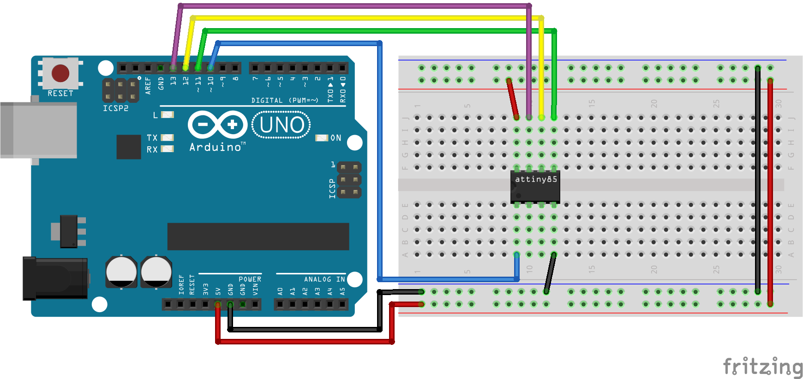
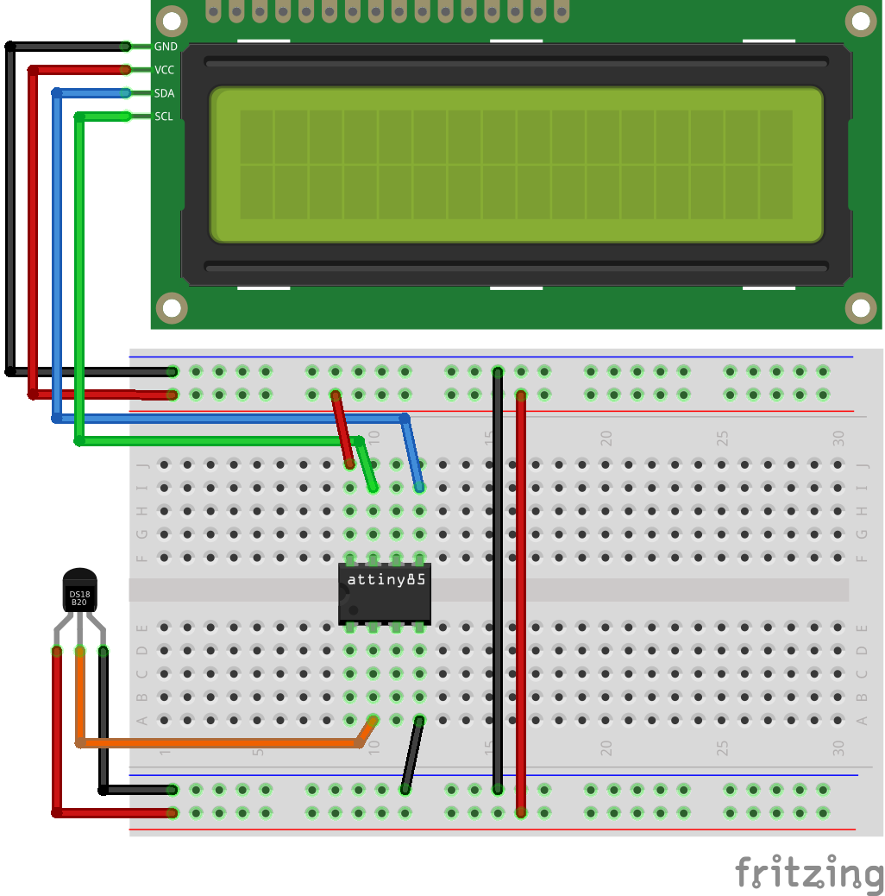
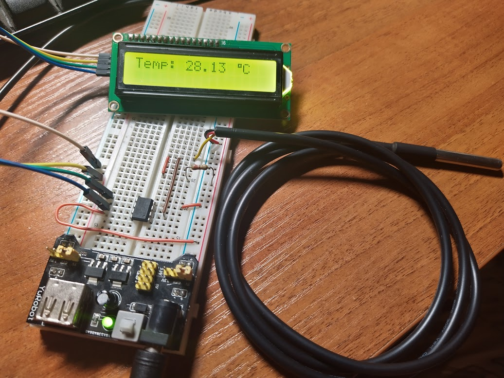
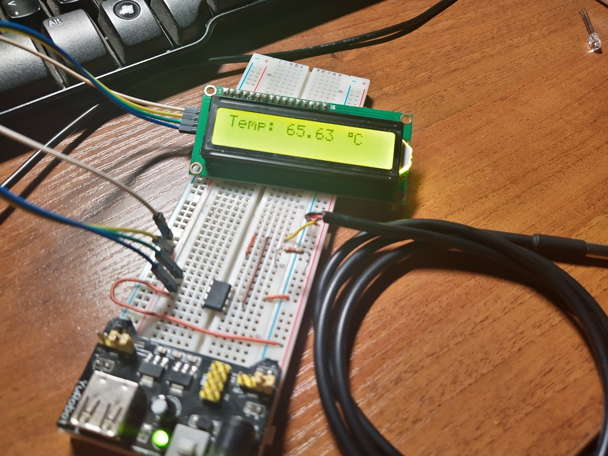

# Исполование контроллера Attiny85

## Необходимые элементы

* [Attiny85](https://aliexpress.ru/item/4000059212852.html)

При желании можно использовать Attiny25 или Attiny45.

## Схема подключения

Для прошивки нашего контроллера нужно использовать програматор, но при отсутствии такой штуки, можно взять любую плату Arduino,
у меня для таких целей валяется UNO. Но для того, что бы она начала работать как програматор, требуется загрузить специальную прошивку. Найти код можно в Arduino IDE пройдя ```File > Examples > ArduinoISP > ArduinoISP```. Более подробно можно почитать на [официальном сайте](https://www.arduino.cc/en/tutorial/arduinoISP)



Далее на чип можно загрузить нашу прошивку. Я решил использовать пример с [термометром](01p4-Termometer-ds18b20.md) и выводить показания на LCD дисплей как в [примере ранее](01p3-Termometer-i2c-lcd.md)



## Добавление в среду разработки

При работе в среде platformio уже все есть и дополнительно чего то делать не требуется.

Но если используется среда Arduino IDE, то следуется зайти ```File > Preferences``` и в строке ```Additional Boards Manager URLs``` добавить ссылку.

```
https://raw.githubusercontent.com/damellis/attiny/ide-1.6.x-boards-manager/package_damellis_attiny_index.json
```

После этого можно зайти в менеджер плат и добавить Attiny85. После этого контроллер станет доступным для выбора.

## Написание кода

Код ничем не отличается и смело можно переносить проекты на данный чип.

Полная версия кода расположенна в директории ```src/08-attiny85```

```cpp
#include "OneWire.h"
#include "LiquidCrystal_I2C.h"

OneWire ds(3);
LiquidCrystal_I2C lcd(0x27,16,2);  

byte tempChar[] = {0x07,0x05,0x07,0x00,0x00,0x00,0x00,0x00};

void setup(){
    lcd.init();
    lcd.backlight();
    lcd.createChar(0, tempChar);
}

void loop(){
    byte data[2];

    ds.reset();
    ds.write(0xCC);
    ds.write(0x44);

    delay(1000);

    ds.reset();
    ds.write(0xCC);
    ds.write(0xBE);

    data[0] = ds.read();
    data[1] = ds.read();

    float temperature =  ((data[1] << 8) | data[0]) * 0.0625;
  
    lcd.setCursor(0,0);
    lcd.print("Temp: " + String(temperature) + "  C");
    lcd.setCursor(12, 0);
    lcd.write(0);
}
```

## Выводы

Данный микроконтроллер может использоваться для различных устройств не трубовательных к питанию. Микроконтроллер может работать при напряжении 1.8V, при этом будет потреблять всего 0.3mA. Соотвественно можно собрать схему с солнечной батареей и аккомулятором Ni-MH, отлично работающей при низких температурах.

Как вариант можно собрать внешний автономный блок для измерения температуры за бортом и передача этой информации на главный контроллер.

Все характеристики можно посмотреть в [описании](https://ww1.microchip.com/downloads/en/DeviceDoc/Atmel-2586-AVR-8-bit-Microcontroller-ATtiny25-ATtiny45-ATtiny85_Datasheet.pdf) к контроллеру.

## Фотофиниш

Градусник на Attiny85



Повысим немного температуру



Все работает как и планировали. При отсутствии дисплея можно значительно было бы понизить напряжение питания. На примере плата работает от 5V.

## Digispark

Ещё есть платы базирующиеся на Attiny85/Attiny167, к примеру:

* [Digispark](https://aliexpress.ru/item/32584084654.html)
* [Digispark Pro](https://aliexpress.ru/item/32617756621.html)

На данных платах уже имеется регулятоп напряжения, на некоторых имеется внешний генератор тактовой частоты, что позволяет контроллеру работать на большей частоте.

Вся необзодимая информация по подключению имеется на сайте [DigistumpArduino](https://github.com/digistump/DigistumpArduino)
